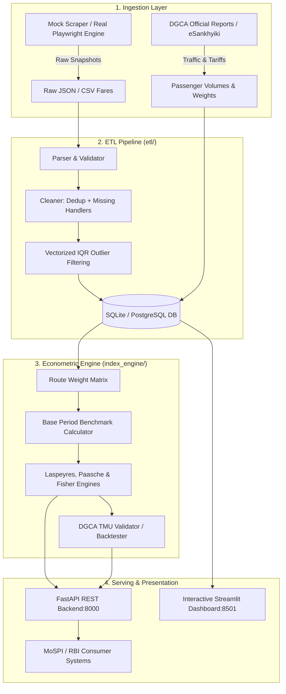

# ✈️ Real-time Airfare Price Index for India (SIH 2026)

> **Augmenting India's Consumer Price Index (CPI) with Automated Airfare Data Collection, Econometric Price Indexing, and Real-time Analytics.**

[](tests/)
[](http://localhost:8000/docs)
[](http://localhost:8501)
[](https://python.org)

---

## 📌 Executive Summary

India's official **Consumer Price Index (CPI)** compiled by the **Ministry of Statistics and Programme Implementation (MoSPI)** currently tracks airfare inflation via physical quotes at physical airline counters. This method fails to capture the dynamic, algorithm-driven, lead-time sensitive nature of contemporary digital airfares.

This project delivers an automated **Airfare Price Index (API) pipeline**:
1. **High-Fidelity Airfare Simulation & Scraping Architecture**: Models real-world dynamic pricing across 20 high-density DGCA trunk routes, 6 domestic airlines, and 5 booking horizons ($T+1, T+7, T+15, T+30, T+45$).
2. **Robust ETL Pipeline**: Validates schemas, cleans duplicates, imputes missing fares, and applies vectorized IQR/Z-score outlier detection without data loss.
3. **Econometric Index Engine**: Implements **Laspeyres**, **Paasche**, and **Fisher Ideal** price indices weighted by annual passenger traffic figures published by the **Directorate General of Civil Aviation (DGCA)**.
4. **Official Backtesting & Validation**: Evaluates compiled route indices against historical DGCA Tariff Monitoring Unit domestic fare benchmarks (correlation, MAPE, RMSE, and directional accuracy).
5. **REST API & Analytics Dashboard**: Built with **FastAPI** (OpenAPI/Swagger) and **Streamlit** (interactive Plotly charts).

---

## 🏛️ System Architecture



---

## 🗂️ Project Directory Structure

```
sih-travel/
├── config.py                 # Central configurations (20 routes, 6 carriers, horizons, distances)
├── run_pipeline.py           # End-to-end pipeline CLI orchestrator
├── run_api.py                # FastAPI server launcher (uvicorn)
├── run_dashboard.py          # Streamlit dashboard runner
├── requirements.txt          # Production dependencies
│
├── scraper/
│   ├── __init__.py
│   └── mock_scraper.py       # High-fidelity dynamic pricing simulation engine
│
├── etl/
│   ├── __init__.py
│   ├── parser.py             # Schema parsing and IATA validation
│   ├── cleaner.py            # Vectorized IQR outlier detection and deduplication
│   └── loader.py             # Database insertion and parameterized query layer
│
├── database/
│   ├── __init__.py
│   ├── db.py                 # SQLite connection manager and schema DDL
│   └── seed_dgca.py          # DGCA passenger traffic weights and validation fares
│
├── index_engine/
│   ├── __init__.py
│   ├── weights.py            # Normalized route traffic weight calculator
│   ├── calculator.py         # Laspeyres, Paasche, and Fisher index algorithms
│   └── validator.py          # DGCA backtesting and metric evaluation
│
├── api/
│   ├── __init__.py
│   ├── schemas.py            # Pydantic data contracts
│   ├── routes.py             # 9 RESTful endpoints
│   └── main.py               # FastAPI application with CORS middleware
│
├── dashboard/
│   ├── __init__.py
│   ├── app.py                # Multi-page Streamlit application entry point
│   ├── components/
│   │   ├── charts.py         # Plotly visualization components
│   │   └── filters.py        # Date, route, carrier, and horizon sidebar filters
│   └── pages/
│       ├── overview.py       # Macro price index trends & MoM metrics
│       ├── route_heatmap.py  # Route × Date pricing intensity heatmap
│       ├── elasticity.py     # Advance booking elasticity curves
│       ├── carrier_compare.py# Airline fare distributions & market shares
│       └── validation.py     # DGCA back-test scatter plots & error metrics
│
├── data/
│   ├── airfare_index.db      # SQLite database (generated)
│   ├── dgca/                 # DGCA report reference files
│   ├── raw/                  # Scraper raw snapshots
│   └── processed/            # Cleaned data export
│
└── tests/
    ├── test_cleaner.py       # ETL cleaning & outlier detection tests
    ├── test_index.py         # Econometric index mathematical property tests
    ├── test_api.py           # FastAPI endpoint integration tests
    └── test_scraper.py       # Booking horizon discount tests
```

---

## 🚀 Quickstart Guide

### 1. Installation

Ensure Python 3.10+ is installed:

```bash
cd "c:\Users\hp\Downloads\sih travel"
pip install -r requirements.txt
```

### 2. Run the Complete Data Pipeline

Run the orchestrator to initialize the database, simulate 30 or 90 days of domestic flights, execute ETL, compute all price indices, and run DGCA validation:

```bash
# Run for 30 days of data
python run_pipeline.py --days 30

# Run for 90 days of data
python run_pipeline.py --days 90
```

### 3. Launch the REST API

```bash
python run_api.py
```
- Interactive Swagger UI: **http://localhost:8000/docs**
- ReDoc Documentation: **http://localhost:8000/redoc**

### 4. Launch the Interactive Dashboard

```bash
streamlit run dashboard/app.py
```
- Open browser at: **http://localhost:8501**

---

## 📊 Econometric Methodology

### 1. Basket of City-Pair Routes
We track **20 high-density domestic routes** selected based on DGCA traffic figures accounting for over 70% of India's scheduled domestic passenger traffic:
- Metro Trunk Corridors: `DEL-BOM`, `DEL-BLR`, `BOM-BLR`, `DEL-CCU`, `DEL-HYD`, `MAA-DEL`, etc.
- Leisure & Tier-2 Connectors: `DEL-GOI`, `BOM-GOI`, `DEL-PAT`, `DEL-JAI`, etc.

### 2. DGCA Route Weighting
Each route $r$ is assigned a weight $w_r$ normalized from DGCA annual passenger volumes:
$$w_r = \frac{\text{Passengers}_r}{\sum_{k \in R} \text{Passengers}_k}$$

### 3. Price Index Formulations

* **Modified Laspeyres Price Index**:
  $$I_L^t = \frac{\sum_{r \in R} w_r \cdot \bar{p}_{r,t}}{\sum_{r \in R} w_r \cdot \bar{p}_{r,0}} \times 100$$
* **Paasche Harmonic Index**:
  $$I_P^t = \frac{1}{\sum_{r \in R} w_r \cdot \left(\frac{\bar{p}_{r,0}}{\bar{p}_{r,t}}\right)} \times 100$$
* **Fisher Ideal Index**:
  $$I_F^t = \sqrt{I_L^t \times I_P^t}$$

Where $\bar{p}_{r,t}$ is the average fare for route $r$ on date $t$ and $\bar{p}_{r,0}$ is the base period price.

---

## 🌐 API Endpoints

| Method | Path | Description |
|---|---|---|
| `GET` | `/api/v1/health` | Pipeline and database status |
| `GET` | `/api/v1/index/daily` | Filterable daily index time-series (Laspeyres/Paasche/Fisher) |
| `GET` | `/api/v1/index/monthly`| Monthly aggregated indices for CPI integration |
| `GET` | `/api/v1/fares/routes` | Monitored routes with DGCA weights and city metadata |
| `GET` | `/api/v1/fares/route/{origin}/{dest}` | Raw and cleaned fare observations by route |
| `GET` | `/api/v1/fares/heatmap` | Route × Date pricing matrix |
| `GET` | `/api/v1/fares/elasticity/{origin}/{dest}` | Advance booking horizon fare curves |
| `GET` | `/api/v1/validation/backtest` | DGCA published fares vs index comparison & metrics |
| `GET` | `/api/v1/carriers` | Carrier market shares, min/max/average fares |

---

## 🧪 Verification & Automated Testing

Run the automated test suite:
```bash
python -m pytest tests/ -v
```

All 12 unit and integration tests verify:
- ETL outlier detection and column integrity.
- Base-period identity ($I_0 = 100$) and Fisher ideal mathematical properties.
- FastAPI schema serialization and endpoint health.
- Lead-time discount curves ($T+1$ vs $T+30$).

---

## 🛡️ Real-World Production Deployment Recommendations

For production deployment within MoSPI/NSO infrastructure:
1. **Scraping Layer**: Deploy headless Playwright workers inside Docker containers with stealth patches (`playwright-stealth`) and residential proxy rotation (Bright Data / Oxylabs) for airline direct websites.
2. **Official APIs**: Complement scraping with Travelpayouts / Aviasales Data API (200 free req/hr) or SerpApi Google Flights engine.
3. **Database**: Switch from SQLite to PostgreSQL by updating `DATABASE_URL` in `config.py`.
4. **Orchestration**: Schedule daily runs at 06:00 AM IST using Apache Airflow or Prefect.
